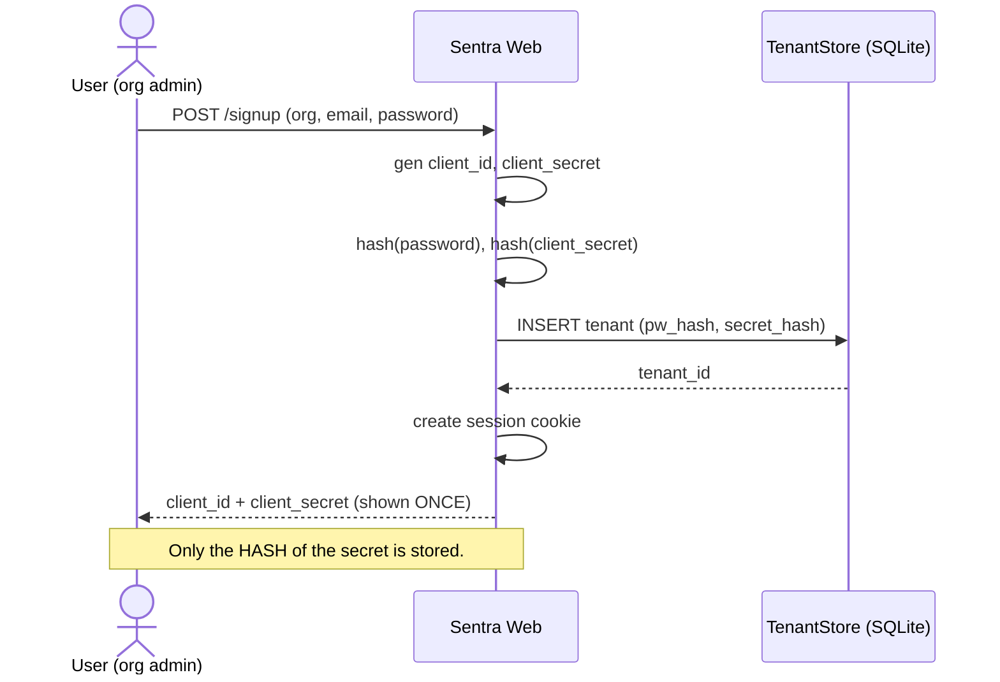
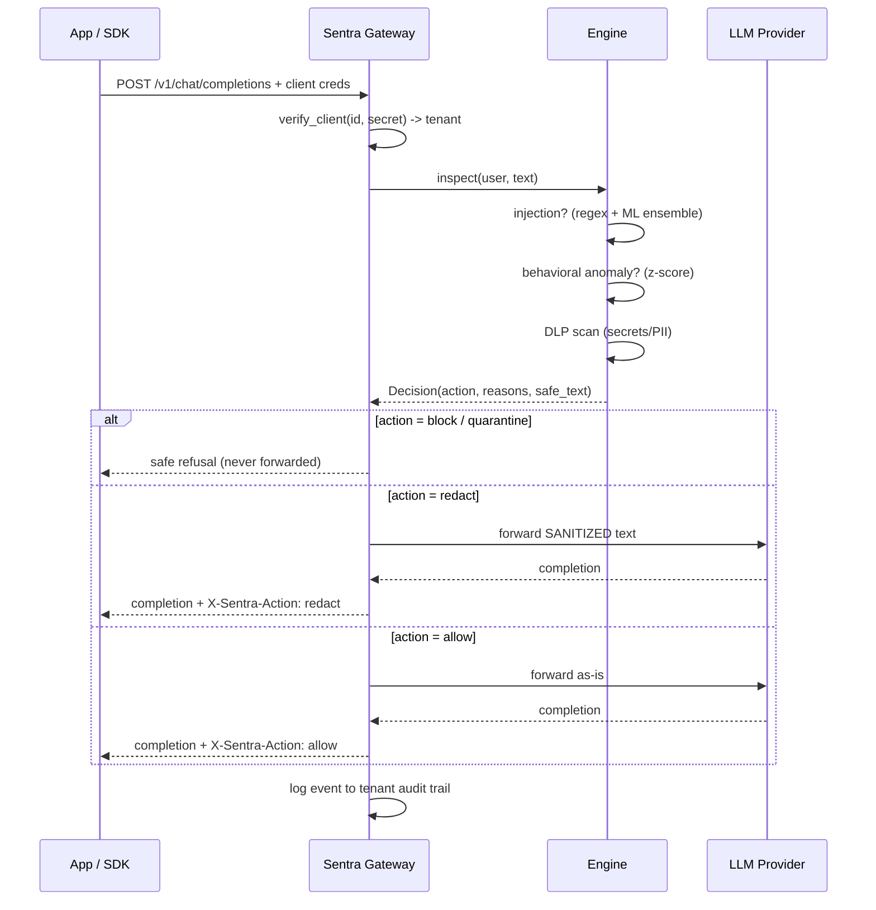
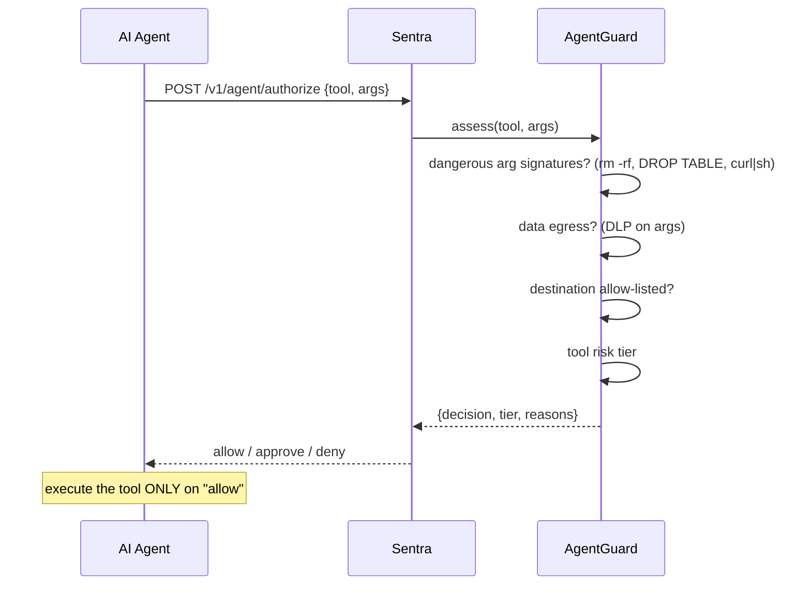
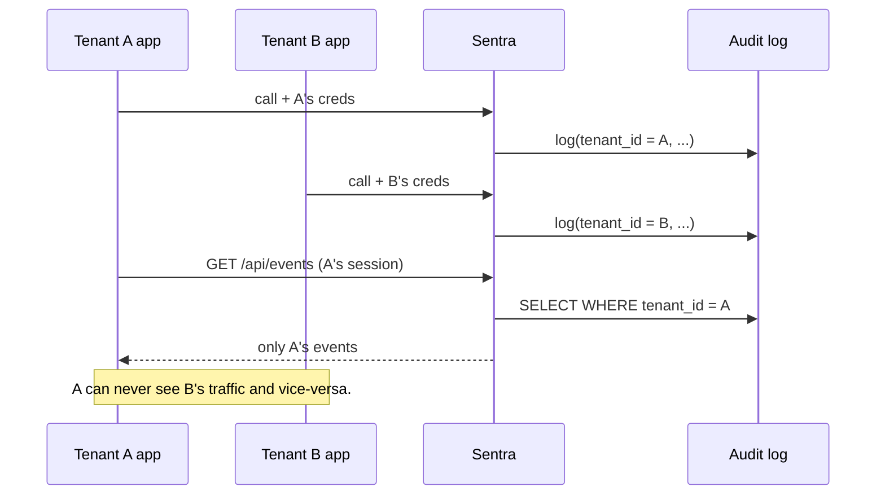

# Sentra — Sequence Diagrams

Rendered by GitHub / any Mermaid viewer. ASCII fallbacks are in the web docs (`/docs`).

## 1. Signup & API credential issuance

## 2. Inline inspection of an AI request (data plane)

## 3. Autonomous-agent action authorization (T-cell layer)

## 4. Multitenant isolation

